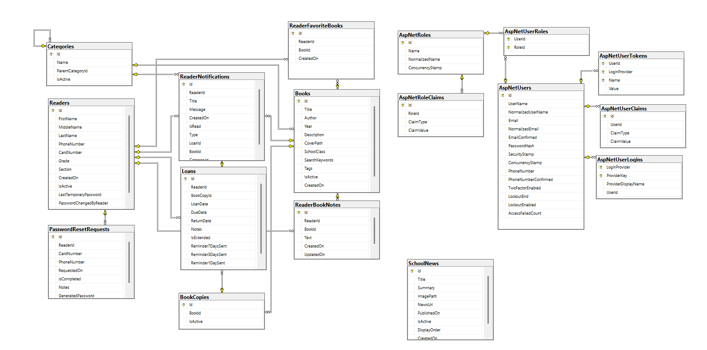

# ObreshkovLibrary

## Описание

**ObreshkovLibrary** е уеб приложение за управление на училищна библиотека, разработено като дипломен проект.  
Системата е предназначена за работа в училищна среда и позволява управление на книги, читатели, категории, заеми, известия и административни дейности.

Приложението поддържа различни потребителски роли и предлага отделни функционалности за администратор, ученик/читател и гост.

---

## Основна цел на проекта

Основната цел на проекта е да се създаде модерна и удобна система за управление на училищна библиотека, която:

- улеснява администратора при управлението на библиотечния фонд;
- позволява на учениците да разглеждат каталога и да следят своите заеми;
- подобрява организацията на книгите, категориите и читателите;
- автоматизира част от процесите чрез известия и справки.

---

## Използвани технологии

- **ASP.NET Core MVC**
- **Entity Framework Core**
- **SQL Server**
- **ASP.NET Core Identity**
- **C#**
- **Razor Views**
- **HTML / CSS / JavaScript**

---

## Архитектура

Проектът е реализиран със слоеста архитектура, като основната бизнес логика е изнесена в отделни **services**.

### Използвани services

- `LoanService`
- `ReaderService`
- `ReaderPortalService`
- `CatalogService`
- `ReaderNotificationService`
- `CategoryService`
- `DashboardService`
- `BookDeactivateService`
- `TemporaryPasswordService`
- `CardNumberGenerator`

### Interfaces

- `ILoanService`
- `IReaderService`
- `IReaderPortalService`
- `ICatalogService`
- `IReaderNotificationService`
- `ICategoryService`
- `IDashboardService`

---

## Потребителски роли

### 1. Администратор
Администраторът има достъп до всички основни функционалности в системата:
- добавяне, редактиране, деактивиране и възстановяване на книги;
- управление на категории;
- управление на читатели;
- създаване и връщане на заеми;
- достъп до архив;
- обработка на заявки за временна парола;
- достъп до административно табло със справки и последни активности.

### 2. Читател
Читателят (ученикът) има достъп до:
- собствен профил;
- текущи заеми;
- история на заемите;
- любими книги;
- лични бележки към книги;
- известия;
- каталог с книги;
- подробности за книги;
- заявка за известяване при наличност.

### 3. Гост
Гостът има достъп до:
- начална страница;
- разглеждане на каталога;
- преглед на подробности за книги;
- информация за библиотеката.

---

## Основни функционалности

### Управление на книги
- добавяне на нова книга;
- редактиране на книга;
- качване на корица;
- поддържане на брой копия;
- деактивиране и възстановяване;
- филтриране и търсене.

### Управление на категории
- създаване на категории и подкатегории;
- бързо създаване на категории;
- преглед на структурата на категориите;
- деактивиране на категории при спазване на ограничения.

### Управление на читатели
- създаване на нов читател;
- автоматично генериране на номер на карта;
- създаване на потребител за вход в системата;
- временна парола;
- редактиране, деактивиране и възстановяване.

### Управление на заеми
- отпускане на книга;
- връщане на книга;
- проверка за налични копия;
- проследяване на активни, дължими и просрочени заеми.

### Читателски портал
- личен профил;
- текущи заеми;
- история;
- любими книги;
- бележки;
- известия.

### Известия
- известия за читатели;
- маркиране на съобщения като прочетени;
- преглед на всички съобщения;
- обработка на напомняния за просрочени заеми.

### Административно табло
- последни заеми;
- книги с наближаващ срок;
- просрочени заеми;
- заявки за временна парола;
- последно добавени книги.

---

## База данни

Приложението използва релационна база данни, реализирана чрез **Entity Framework Core**.

Основни обекти в системата:
- `Book`
- `BookCopy`
- `Category`
- `Reader`
- `Loan`
- `ReaderFavoriteBook`
- `ReaderNotification`
- `ReaderBookNote`
- `PasswordResetRequest`
- `SchoolNews`

---

## Стартиране на проекта

### 1. Изисквания
- Visual Studio
- .NET SDK
- SQL Server

### 2. Настройка
- отвори проекта в Visual Studio;
- провери connection string-а в `appsettings.json`;
- изпълни миграциите, ако е необходимо;
- стартирай проекта.

### 3. База данни
При стартиране проектът използва seed данни за начално попълване на основна информация.

---

## Приложена диаграма на базата данни

Към проекта е приложена ER диаграма на базата данни във файл:

Диаграмата показва основните таблици и връзките между тях в системата.

---

## Практическа стойност на проекта

Системата може да се използва като основа за реална училищна библиотека и да бъде доразвита с допълнителни функционалности, например:
- онлайн резервация на книги;
- по-разширени справки;
- статистики;
- по-сложна система за известия;
- коментари и оценки за книги;
- по-пълна автоматизация на библиотечните процеси.

---

## Автор

**Мелис Вежди**

Дипломен проект  
специалност: **Приложен програмист**